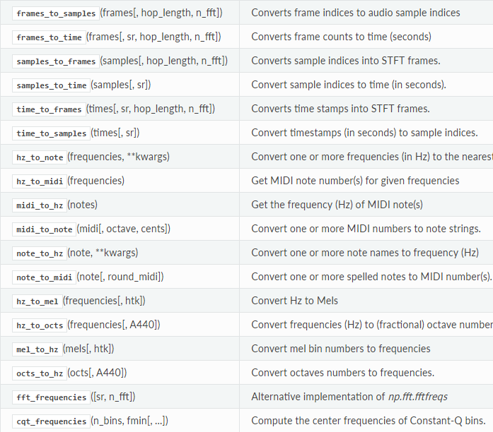

- [序言](#%e5%ba%8f%e8%a8%80)
- [安装](#%e5%ae%89%e8%a3%85)
  - [pypi](#pypi)
  - [conda](#conda)
- [常用功能](#%e5%b8%b8%e7%94%a8%e5%8a%9f%e8%83%bd)
  - [核心音频处理函数](#%e6%a0%b8%e5%bf%83%e9%9f%b3%e9%a2%91%e5%a4%84%e7%90%86%e5%87%bd%e6%95%b0)
    - [音频处理](#%e9%9f%b3%e9%a2%91%e5%a4%84%e7%90%86)
    - [频谱表示](#%e9%a2%91%e8%b0%b1%e8%a1%a8%e7%a4%ba)
    - [幅度转换](#%e5%b9%85%e5%ba%a6%e8%bd%ac%e6%8d%a2)
    - [时频转换](#%e6%97%b6%e9%a2%91%e8%bd%ac%e6%8d%a2)
  - [特征提取](#%e7%89%b9%e5%be%81%e6%8f%90%e5%8f%96)
  - [绘图显示](#%e7%bb%98%e5%9b%be%e6%98%be%e7%a4%ba)
- [常用功能代码实现](#%e5%b8%b8%e7%94%a8%e5%8a%9f%e8%83%bd%e4%bb%a3%e7%a0%81%e5%ae%9e%e7%8e%b0)
  - [特征提取](#%e7%89%b9%e5%be%81%e6%8f%90%e5%8f%96-1)
    - [提取 Log-Mel Spectrogram 特征](#%e6%8f%90%e5%8f%96-log-mel-spectrogram-%e7%89%b9%e5%be%81)
    - [提取 MFCC 特征](#%e6%8f%90%e5%8f%96-mfcc-%e7%89%b9%e5%be%81)

# 序言
librosa是一个用于对音频/音乐进行分析/处理的Python工具包，一些常见的时频处理、特征提取、绘制声音图形等功能应有尽有。

Github地址：https://github.com/librosa/librosa

# 安装

## pypi
最简单的方法就是用 pip 安装，可以满足所有的依赖关系
```
pip install librosa
```
## conda
如果安装了Anaconda，可以通过conda命令安装：
```
conda install -c conda-forge librosa
```

# 常用功能

## 核心音频处理函数
这部分介绍了最常用的音频处理函数，包括音频读取函数load()，重采样函数resample()，短时傅里叶变换stft()，幅度转换函数amplitude_to_db()以及频率转换函数hz_to_mel()等。

这部分函数很多，详细参见 http://librosa.github.io/librosa/core.html

### 音频处理


### 频谱表示


### 幅度转换


### 时频转换


## 特征提取
列举了一些常用的频谱特征提取方法，包括常见的Mel Spectrogram、MFCC、CQT等。

详细参见 http://librosa.github.io/librosa/feature.html


## 绘图显示
包含了常用的频谱显示函数specshow()，波形显示函数waveplot()等

详细参见 http://librosa.github.io/librosa/display.html


# 常用功能代码实现

## 特征提取

### 提取 Log-Mel Spectrogram 特征

Log-Mel Spectrogram 特征是目前在语音识别和环境声音识别中很常用的一个特征，由于CNN在处理图像上展现了强大的能力，使得音频信号的频谱图特征的使用愈加广泛，甚至比 MFCC 使用的更多。

在librosa中，Log-Mel Spectrogram特征的提取只需几行代码：

```python
import librosa
# Load a wav file
y, sr = librosa.load('./audio.wav', sr=None)
# Extract mel spectrogram feature
melspec = librosa.feature.melspectrogram(y, sr, n_fft=1024, hop_length=512, n_mels=128)
# Convert to log scale
logmelspec = librosa.power_to_db(melspec)
print(logmelspec.shape) # 打印结果可能为(128, 334)
```

可见，Log-Mel Spectrogram 特征是二维数组的形式，128表示Mel频率的维度（频域），334为时间帧长度（时域），所以 Log-Mel Spectrogram 特征是音频信号的时频表示特征。

其中，n_fft指的是窗的大小，这里为1024；hop_length表示相邻窗之间的距离，这里为512，也就是相邻窗之间有50%的overlap；n_mels为mel bands的数量，这里设为128。

### 提取 MFCC 特征

梅尔频率倒谱系数(MFCC)

MFCC特征是一种在自动语音识别和说话人识别中广泛使用的特征。

在librosa中，提取MFCC特征只需要一个函数：

```python
import librosa

# Load a wav file
y, sr = librosa.load('./audio.wav', sr=None)
# Extract mfcc feature
mfccs = librosa.feature.mfcc(y=y, sr=sr, n_mfcc=40)
print(mfccs.shape) # 打印结果可能为(40, 334)
```

librosa还有很多其他音频特征的提取方法，比如CQT特征、chroma特征等。
