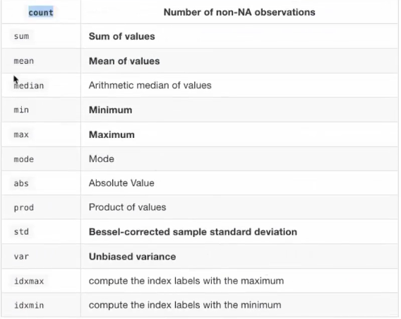
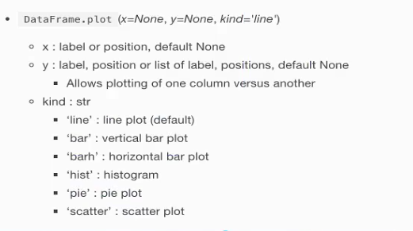
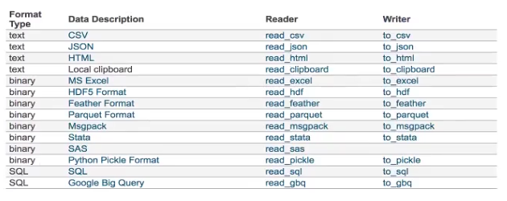

官方网站 https://pandas.pydata.org/

pandas是一款数据处理工具，集成了 **numpy** 以及 **matplotlib** ，拥有便捷的数据处理以及文件读取能力。

# 核心数据结构

## 1.DataFrame
```
numpy仅用作计算，在数据表示方面还有所欠缺，很难从数据上面看出信息表达的含义，在这里我们可以将DataFrame看作是有行列索引(标题)的二维数组
```
### I.属性
`pd.DataFrame(values, index, columns)`
- shape(形状)
- values(除去行列索引后的值)
- T(行列转置)
- index(行索引)
- columns(列索引)

### II.方法
- head(size)——显示前size行数据，默认前5行
- tail(size)——显示后size行数据，默认后5行

### III.索引
- 修改行列索引值
  ```
  只能整体修改，不能修改单独某一项
  ```
- 重设索引

  `reset_index(drop=False)`
  ```
  重置索引值，默认drop为False，不删除原索引，将其单独立为一列，在此基础上将索引重置
  ```
- 设置新的索引

  `set_index(keys, drop=True)`
  ```
  keys：列索引名称或者列索引名称的列表
  drop：boolean，默认为True，当做新的索引，删除原来的列
  ```

### IV.MultiIndex
```
多级或分层索引对象，可用于存放三维数据
```

- index属性
  - names: levels的名称
  - levels: 每个level的元组值

## 2.Series
```
可理解为带索引的一维数组
```

### I.属性
- index —— 索引项
- values —— 索引值，numpy.ndarray类型

### II.创建Series
- 通过已有数据创建
  ```python
  # 指定内容，默认索引
  pd.Series(np.arange(10))
  # 指定索引
  pd.Series([6.7,5.6,3,10,2],index=[1,2,3,4,5])
  ```
- 通过字典数据创建
  ```python
  pd.Series({'red':1000,'blue':100,'green':500,'yellow':200})
  ```

### III.索引操作
1. 直接索引

   必须满足先列后行的规则，data[col][row]

2. 按名字索引

   data.locp[索引名, 索引名]

   或者

   data.locp[索引名][索引名]

3. 直接按照数字索引

   data.iloc[number, number]

4. IX组合索引(数字和名字组合)

   data.ix[parm，parm]

在进行索引操作的时候，可以结合前面的index以及columns.get_indexer等方法进行数据的获取

### IV.赋值
按照上述索引方法找到对应数据进行赋值即可

### V.排序
- 按照内容排序

  `sort_values(by=,ascending=)`

  - by：排序关键字，可指定单键或者多建(以列表形式赋给by即可)
  - ascending：默认升序，False则降序

- 按照索引排序

  `sort_index()`

  - 排序方法对 DataFrame 以及 Series 都是适用的，前者需要指定关键字，但是Series的一维数据只需要直接调用方法执行即可。

### VI.算数运算、逻辑运算

### VII.统计运算
```
max、mean、median、var、std等，此外可以使用 describe() 方法统一进行运算，它会自动统计出一些常用运算结果
```



# 作图



# 文件读取与存储


