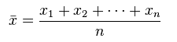
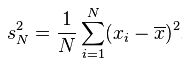
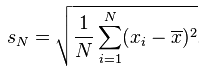
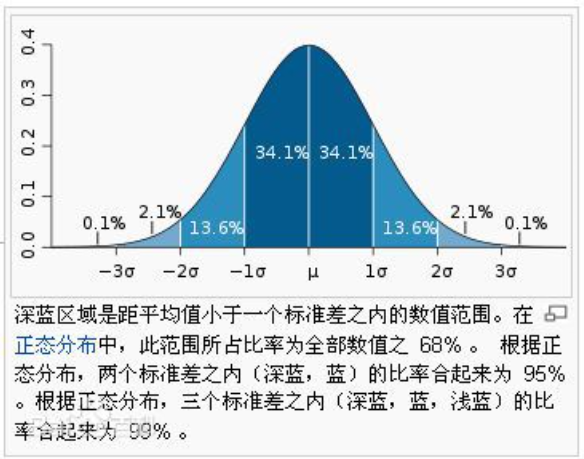
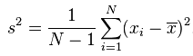
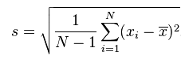

# 开篇
对于一维数据的分析，最常见的就是计算 **平均值(Mean)** 、 **方差(Variance)** 和 **标准差(Standard Deviation)** 。在做【特征工程】的时候，如果出现缺失值，那么经常会使用 **平均值** 或者 **中位数** 等进行填充。

# 平均值(Mean)
平均值的概念很简单：所有数据之和除以数据点的个数，以此表示数据集的平均大小；其数学定义为：

# 方差(Variance)、标准差(Standard Deviation)
方差这一概念的目的是为了表示数据集中数据点的离散程度；其数学定义为：

标准差与方差一样，表示的也是数据点的离散程度；其数学上定义为方差的平方根：

# 为什么使用标准差？
与方差相比，使用标准差来表示数据点的离散程度有3个好处：
1. 表示离散程度的数字与样本数据点的数量级一致，更适合对数据样本形成感性认知。
2. 表示离散程度的数字单位与样本数据的单位一致，更方便做后续的分析运算。
3. 在样本数据大致符合正态分布的情况下，标准差具有方便估算的特性：66.7%的数据点落在平均值前后1个标准差的范围内、95%的数据点落在平均值前后2个标准差的范围内，而99%的数据点将会落在平均值前后3个标准差的范围内。

# 贝赛尔修正
在上面的方差公式和标准差公式中，存在一个值为N的分母，其作用为将计算得到的累积偏差进行平均，从而消除数据集大小对计算数据离散程度所产生的影响。不过，使用N所计算得到的方差及标准差只能用来表示该数据集本身(population)的离散程度；如果数据集是某个更大的研究对象的样本(sample)，那么在计算该研究对象的离散程度时，就需要对上述方差公式和标准差公式进行贝塞尔修正，将N替换为N-1：

经过贝塞尔修正后的方差公式：

经过贝塞尔修正后的标准差公式：

# 公式的选择
是否使用贝塞尔修正，是由数据集的性质来决定的：如果只想计算数据集本身的离散程度(population)，那么就使用未经修正的公式；如果数据集是一个样本(sample)，而想要计算的则是样本所表达对象的离散程度，那么就使用贝塞尔修正后的公式。在特殊情况下，如果该数据集相较总体而言是一个极大的样本 (比如一分钟内采集了十万次的IO数据) — 在这种情况下，该样本数据集不可能错过任何的异常值(outlier)，此时可以使用未经修正的公式来计算总体数据的离散程度。

# 平均值与标准差的适用范围及误用
大多数统计学指标都有其适用范围，平均值、方差和标准差也不例外，其适用的数据集必须满足以下条件：

## 中部单峰
1. 数据集只存在一个峰值。
2. 这个峰值必须大致位于数据集中部。

遗憾的是，在现实生活中，很多数据分布并不满足上述两个条件；因此，在使用平均值、方差和标准差的时候，必须谨慎小心。

----

**如果数据集仅仅满足一个条件：单峰。那么，峰值在哪里？峰的宽带是多少？峰两边的数据对称性如何？有没有异常值(outlier)？为了回答这些问题，除了平均值、方差和标准差，需要更合适的工具和分析指标，而这，就是中位数、均方根、百分位数和四分差的意义所在。**
