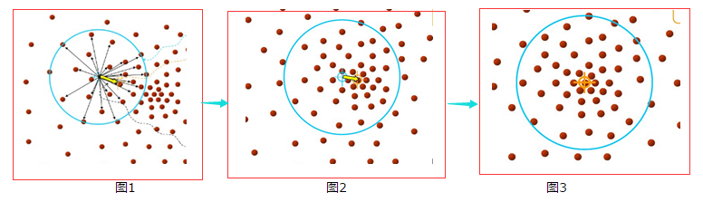

下面介绍一下机器学习中几种常用的聚类算法。

## K-Means（K均值算法）

## Mean-Shift（均值迁移算法）

### 图解过程

用下面几张图来说明Mean-Shift的基本过程。

## Spectral Clustering（谱聚类算法）

## Hierarchical Clustering（层次聚类算法）

## DBSCAN（Density-Based Spatial Clustering of Applications with Noise，具有噪声的基于密度的聚类算法）

## Birch
